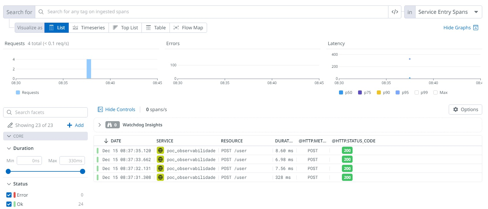
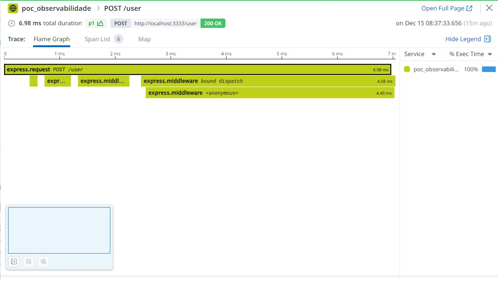
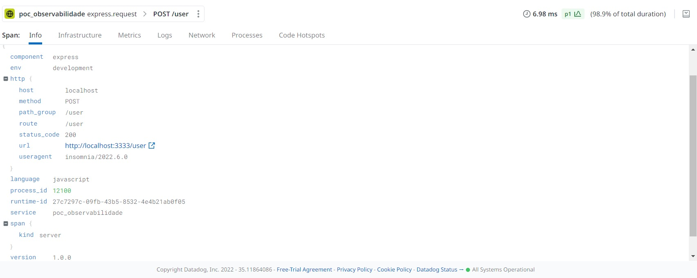

# POC Observabilidade

## Objetivo

Este projeto tem como objetivo demonstrar a utilização de ferramentas de observabilidade para monitorar a aplicação.

- [x] Tracing distribuído
- [x] Logs

## Tecnologias

- [x] NodeJS
- [x] Express
- [x] DataDog
- [x] dataDog Agent

## Como executar

### Pré-requisitos

- [x] NodeJS

### Instalação

- [x] Instalar o [DataDog Agent](https://docs.datadoghq.com/agent/)

### Execução

- [x] Executar o comando `npm install` para instalar as dependências
- [x] Executar o comando `npm run dev` para iniciar a aplicação

### Observabilidade

- [x] Acessar o [DataDog](https://app.datadoghq.com/) e verificar os dados de observabilidade

## Resultado

 

 

